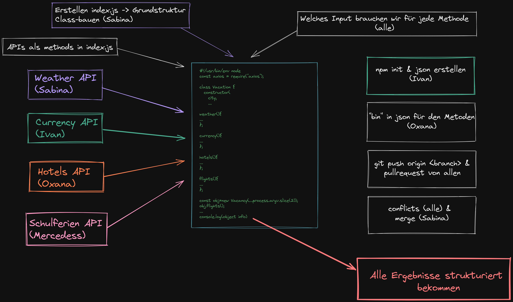

# First Node API Project

# Welcome to our group project!

We have made  **Travel Info Agency in Germany**. 
It contains: 
 - upcoming school holiday
 - hotel search 
 - weather situation
 - currency converter

# Application Programming Interface - API

We are using **API**  in  **Node.js** to show via **console.log**
|-----| API  |
|--|--|
|  Oxana| booking.com |
|Ivan|https://www.frankfurter.app/|
|  Sabina| weatherapi.com |
|Mercedes|rapidapi.com|
| |  

## Oxana API 
List of ***hotels*** in the desired location

 **Parameters :**  city, Check-in and Check-out Date
 **Result :** Hotel name, Address, Price

## Ivan API
Current foreign ***exchange*** rates published by the European Central Bank
**Parameters :** amount
**Result :** EUR, USD, GBP, RON

## Sabina API
Current ***weather*** in the desired location
**Parameters :** city name
**Result :** temperature, current situation

## Mercedes API
Upcoming ***school holidays*** in the desired federal state
**Parameters :** city
**Result :** name of holidays, start in, length, how many days in week/weekend

